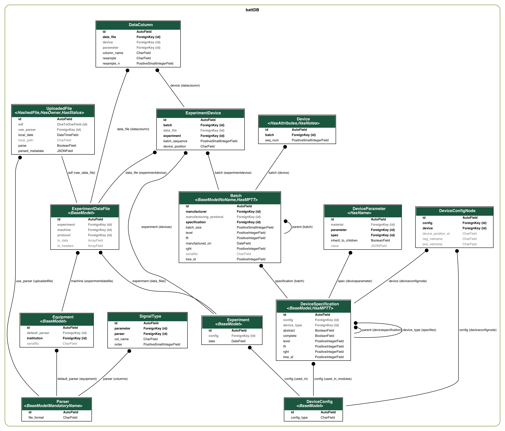

# Liionsden

:warning: **Liionsden is currently in development** :warning:

Liionsden is a platform for storing data about lithium-ion batteries and their performance. It automatically parses data from the output files of battery cycler machines and stores this information in a database, associating it with specific experiments and devices. Metadata is stored about specific experiments, batches of devices and individual devices. 

The development server is running [here](https://liionsden.rcs.ic.ac.uk/) (internal to Imperial College). 

It will be possible to browse the database, as well as add to it, via a web-app and programatically via an API.

Liionsden is developed at Imperial College London, funded by the [Faraday Institution Multi-scale Modelling Project](https://www.faraday.ac.uk/research/lithium-ion/battery-system-modelling/). 

## Database structure

The database currently stores recorded cycler data along with metadata about:
- **Experiments:** protocol, equipment used, configuration... 
- **Devices:** batch number, specification, chemical composition...

A simplified version of the main `battDB` app is shown below. This does not include models in the `common` and `dfndb` app, which deal with data relating to users, organisations, components, parameters, methods.

## Usage

Public data in the database can be browsed using the web platform. Registered "contributor" users can add experimental data, register equipment and batches of devices via the web platform. 

In future, this will also be posible via the API.

## Local installation

If you want to run a local version of Liionsden, we recommend using [Docker](https://www.docker.com/).

Full instructions to follow once the platform is in production.

## Development notes

### Contribution guidelines

### Related open-source software

- [Galvanalyser](https://github.com/Battery-Intelligence-Lab/galvanalyser)
- [Liiondb](https://github.com/ndrewwang/liiondb) ([web app](http://www.liiondb.com/))
- [PyBaMM](https://www.pybamm.org/)

### TODOs 

Generally development TODOs should be tracked in [issues](https://github.com/ImperialCollegeLondon/Faraday-liionsden/issues) and/or [project board](https://github.com/ImperialCollegeLondon/Faraday-liionsden/projects/1).

### Resources
* https://stackoverflow.com/questions/23779250/using-proxy-model-in-django-admin-to-customize-change-list-view
