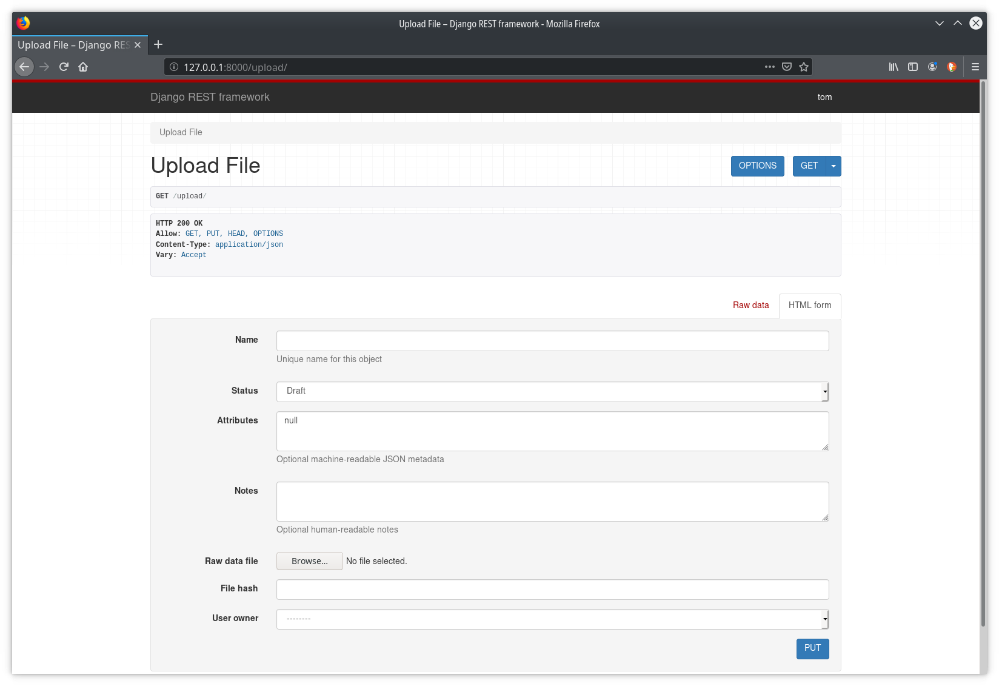
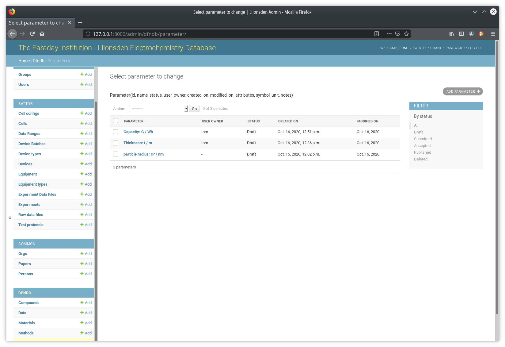
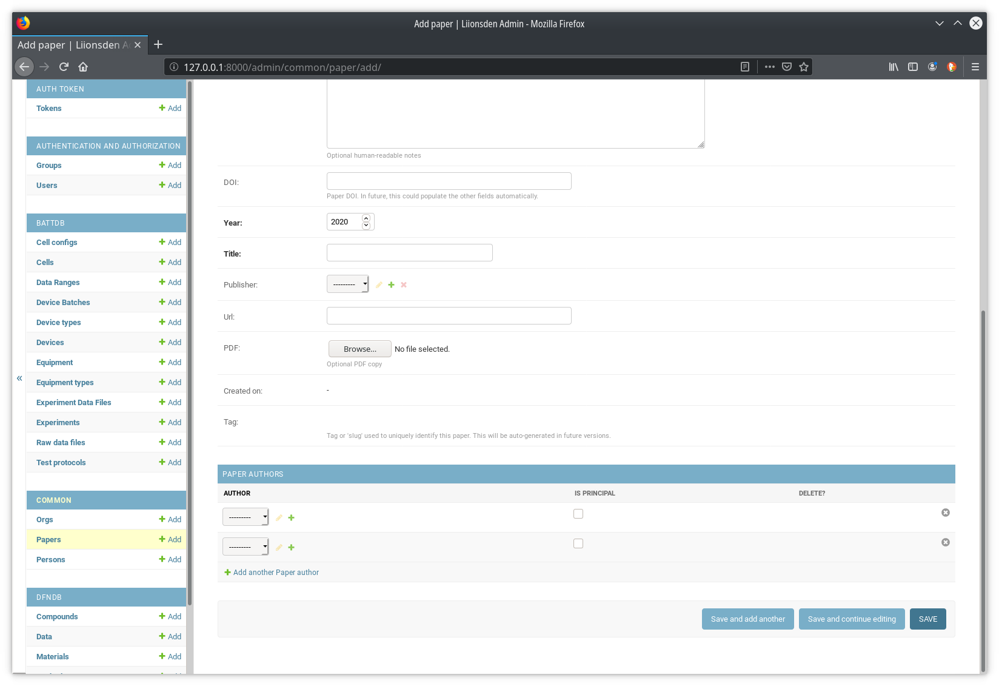

LiIonsDen Electrochemistry Database
-----------------------------------------

Liionsden is a Web application comprising a database of electrochemical (Lithium Battery) experimental test data, ie Cyclic Voltammetry. Users (scientists) may upload data files from Battery Cycler machines via either the Web interface, or via an automated tool/API. Supported cycler formats include Biologic and Maccor.
Users can then view data as a graph via the web interface, whereby multiple data sets (e.g. cycles of the same cell, different cells, different tests) can be displayed on the graph. 
The Web App was originally developed by Luke Pitt (Oxford Robotics Institute) and was later refactored by Ivan Kotegov (Imperial College London). Luke continues development on his own branch.

This WebApp builds on development from Ivan and Luke - it combines features of both into a new Django-based app, while adding new features such as automated data analysis, enhanced metadata, protocol description, and support for additional cycler types.

Code, documentation and agile issues board can be found at https://gitlab.com/towen/faraday-liionsden  (private project - account & authorisation required for access)
A log of changes and ideas can be found in (django-battdb/README.md)

Ideas drawn from:
* [The original liionsden project by Ivan & Luke at Imperial & Oxford](https://github.com/FaradayInstitution/liionsden)
* [Universal Battery Database by Samuel Buteau](https://github.com/Samuel-Buteau/universal-battery-database)
* [dfndb](https://github.com/ndrewwang/dfndb) by @ndrewwang
* Inspiration from commerical products such as [Voltaiq](http://www.voltaiq.com)
* Cycler machines software e.g. Biologic BT-Lab

Screenshots:

