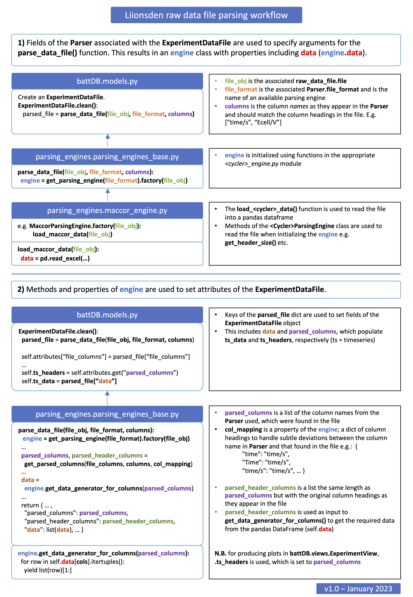

# Parsing data

## Raw data file parsing workflow

The process for parsing raw data files is summarised in the below diagram. The
parsing process is initialised when an `ExperimentDataFile` object is saved. The
data itself and column headings end up in the `ExperimentDataFile.ts_data`
(`ArrayField(ArrayField(FloatField)))` and `ExperimentDataFile.ts_columns`
(`ArrayField(CharField))`) fields, respectively.



## Adding new parsers

Parsers map column headers to parameters (`dfndb.Parameter` objects). A list of
parsers in the database can be viewed at
[<website_root>/battDB/parsers/](http://localhost:8000/battDB/parsers/).<!-- markdown-link-check-disable-line -->


Parsers can be created and edited via the admin site at
[<website_root>/battDB/parser](http://localhost:8000/admin/battDB/parser/).<!-- markdown-link-check-disable-line -->
Parameters are mapped to column names using the `SignalType` model (through
table). The "COL NAME" should exactly match the expected column header as it
appears in the file.

The "file format" field should be set to the file format that the parser is
intended for. This will be the name of one of the underlying "parsing engines"
(see below).


## Adding new parsing engines

Parsing engines are the underlying code that actually parses the data files.
Currently there are two parsing engines:

- Maccor
- Biologic

These parsing engines both make use of different functions and imported Python
packages to deal with data files from each type of machine, e.g. by establishing
where the header finishes and column heading starts.

To add a parsing engine for a completely new type of file, a new
`<cycler>_engine.py` file should be added to `parsing_engines/`. See the current
biologic and maccor engines for inspiration.

## Mappings

Although the column names in the `SignalTypes` associated with a parser should
exactly match the column header as it appears in the file, there is code that
checks for near matches as defined in `parsing_engines/mappings.py`. For
example, the generic mappings include:

```python
{
    ...
    "time": "time/s",
    "Time": "time/s",
    ...
}
```

This ensures that if "time" or "Time" is encountered as a file header and
"time/s" is an expected column for the selected parser, that column will still
be parsed.

In future, it would provide more flexibility and transparency to define these
mappings on a per-parser basis rather than hard coding them in the parsing
engines code.
